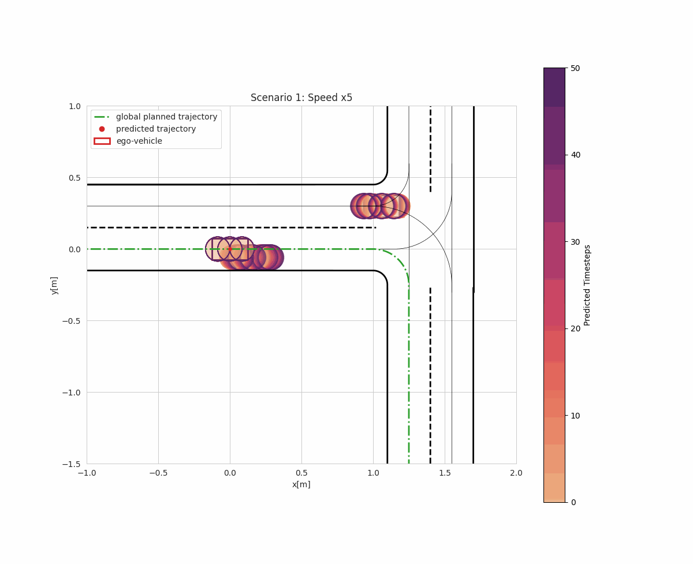
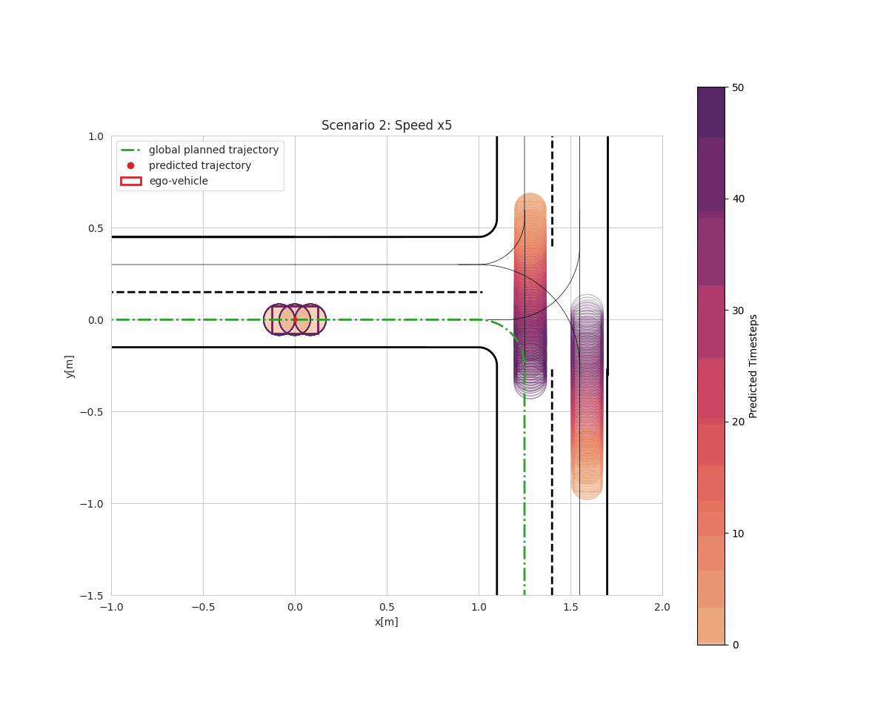
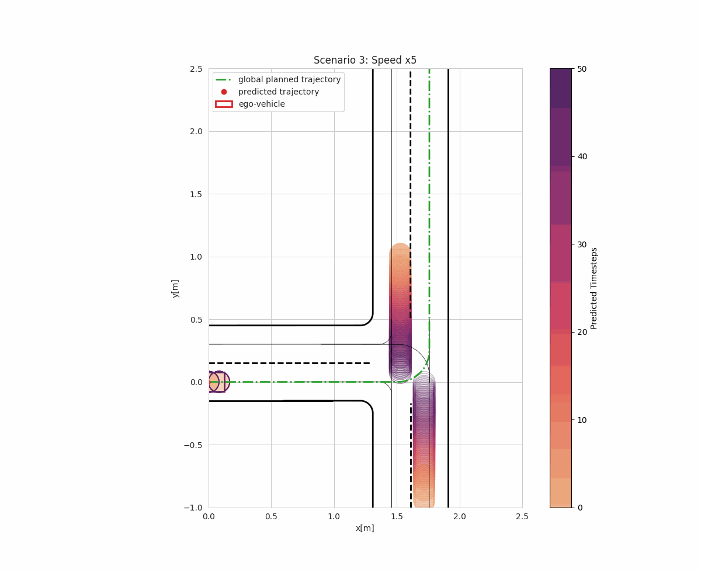

# NMPC-TTC 


## 📌 Description
This project simulates a miniature car navigating a track with dynamic obstacles. The simulation considers prediction horizons, reference velocities, and collision avoidance techniques to model realistic urban scenarios.

## 🚀 Installation
### Prerequisites
- Python 3.8+
- ACADOS and CASADI installations for python :  [https://docs.acados.org/installation/](https://docs.acados.org/installation/index.html#linux-mac)

### Other requirements
To install other dependencies, run:
```bash 
pip install -r requirements.txt
```


## 📊 Visualizations
### Scenario (S1)



### Scenario (S2)


### Scenario (S3)



## 🔧 Usage
To run the simulation, execute:
```bash
cd acados_dev/mpc-ttc
python main.py
```
Alternatively, to specify parameters, use:
```bash
cd acados_dev/mpc-ttc
python main.py --params params/scenario1.json 
```
Optionnal arguments
```bash
  --params   Path to the JSON configuration file
  --show     Show the plot after running the simulation
  --save     Save the plot after running the simulation
  --seed     Seed for the random scenario 
```

## ⚙️ Configuration
The simulation parameters are stored in JSON files inside the [`params/`](acados_dev/mpc-ttc/params/) directory. Example:
```json
{
        "TRACK_FILE": "LMS_Track7.txt",
        "scenario": 3,
        "PREDICTION_HORIZON": 5.0,
        "TIME_STEP": 0.1,
        "NUM_DISCRETIZATION_STEPS": 50,
        "MAX_SIMULATION_TIME": 30.0,
        "DIST_THRESHOLD": 1.0,
        "N_OBSTACLES_MAX": 3,
        "OBSTACLE_WIDTH": 0.15,
        "OBSTACLE_LENGTH": 0.25,
        "Q_SAFE": [5, 5, 1, 1, 1, 1, 1, 1],
        "QE_SAFE": [1, 10, 1, 1, 1, 1],
        "Q_OBB": [1000.0, 0.1, 0.0000001, 0.00000001, 0.1, 0.005, 0.001, 0.05],
        "QE_OBB": [5000.0, 0.1, 1.0, 0.00000001, 0.005, 0.005],
        "Sgoal": 3.0,
        "cov_noise": [0.00025, 0.00025],
        "ttc": "True",
        "eta":0.9973
    }
```
Feel free to test your own parameters and your own scenarios (located in the [`tracks/`](acados_dev/mpc-ttc/tracks/) directory)

## 🌟 Features
- 🚀 Predictive control of a miniature car
- 🏎️ Dynamic obstacle avoidance 
- 📊 Plots and analyzes results
- 🔁 Supports multiple scenarios with JSON configuration and txt files

## 🤝 Contributing
Contributions are welcome! Follow these steps:
1. Fork the repository
2. Create a new branch: `git checkout -b feature-branch`
3. Commit changes: `git commit -m "Added a new feature"`
4. Push: `git push origin feature-branch`
5. Open a Pull Request


## 🙌 Acknowledgments
- This project contains modified parts of the code that has been used for the simulations and experiments associated with the 
publication: *NMPC for Racing Using a Singularity-Free Path-Parametric Model with Obstacle Avoidance - Daniel Kloeser, Tobias Schoels, Tommaso Sartor, Andrea Zanelli, Gianluca Frison, Moritz Diehl. Proceedings of the 21th IFAC World Congress, Berlin, Germany - July 2020*. 

